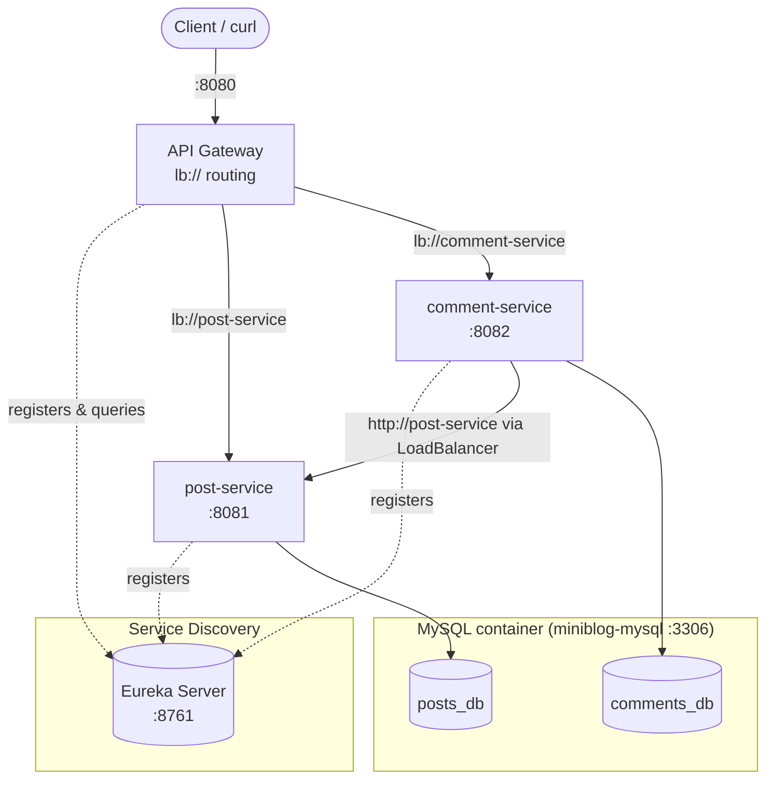
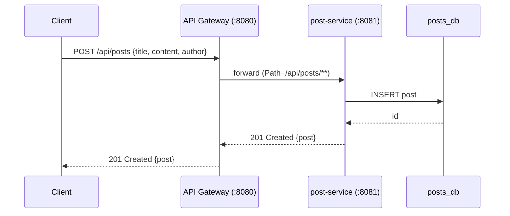
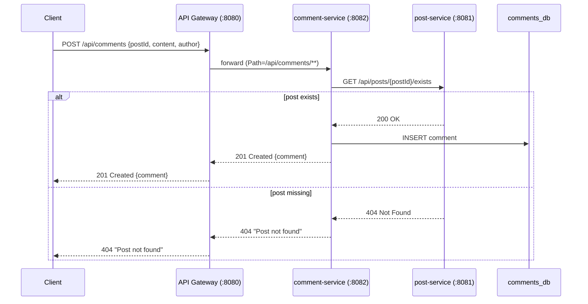
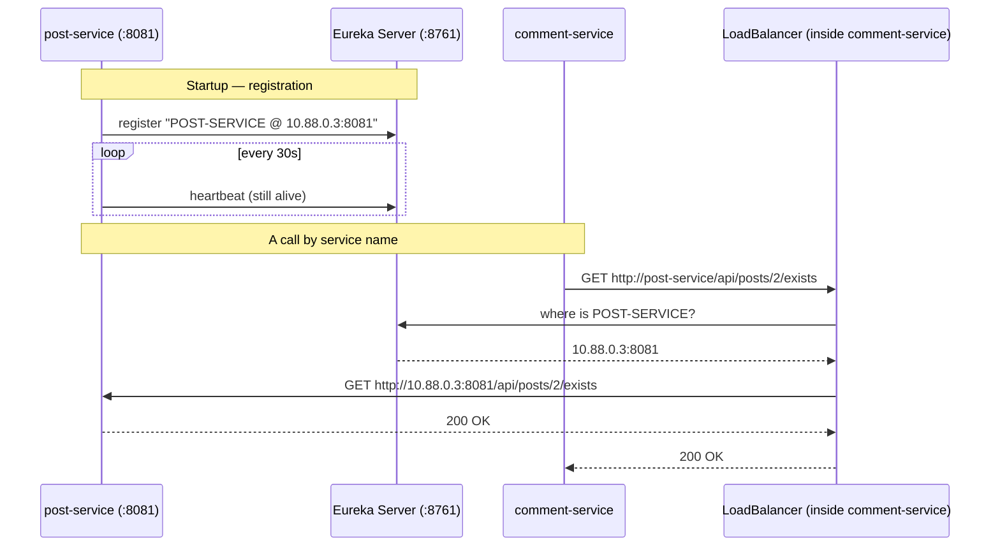
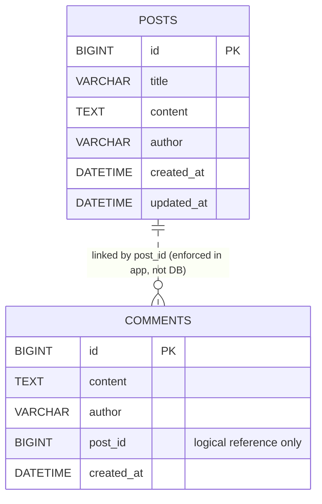

# Mini Blog — Microservices Documentation

A learning project that evolves a monolithic **Mini Blog / Notes** app into a
**microservices** system: two small services (each with its own database), behind a
**Spring Cloud API Gateway**, coordinated by a **Eureka service-discovery registry**.

---

## Table of contents
1. [Architecture](#1-architecture)
2. [Request flow diagrams](#2-request-flow-diagrams)
3. [Services & responsibilities](#3-services--responsibilities)
4. [Project structure](#4-project-structure)
5. [Implementation details](#5-implementation-details)
6. [Service discovery (Eureka)](#6-service-discovery-eureka)
7. [Data model](#7-data-model)
8. [API reference](#8-api-reference)
9. [How to run](#9-how-to-run)
10. [Verify the features (commands)](#10-verify-the-features-commands)
11. [Check the databases (commands)](#11-check-the-databases-commands)
12. [Troubleshooting](#12-troubleshooting)

> Diagrams are also saved as individual `.mmd` files in [`diagrams/`](diagrams).

---

## 1. Architecture

Four Spring Boot apps + one MySQL container (holding two independent databases).
Clients only ever talk to the **API Gateway** on port `8080`. Services find each
other through the **Eureka registry** — no hardcoded host:port anywhere.



**Key principles**
- **Single entry point** — clients know only the gateway (`:8080`); backend ports are hidden.
- **Database per service** — `post-service` owns `posts_db`, `comment-service` owns `comments_db`. No shared tables, no cross-database joins.
- **Inter-service communication over HTTP** — `comment-service` asks `post-service` whether a post exists before saving a comment.
- **Service discovery** — every service registers with **Eureka** by name; the gateway and `comment-service` resolve those names to live addresses at runtime (client-side load balancing).

---

## 2. Request flow diagrams

### Create a post (simple routing)



### Add a comment (inter-service call)



### Service registration & discovery (Eureka)



---

## 3. Services & responsibilities

| Service | Port | Database | Responsibility |
|---|---|---|---|
| **eureka-server** | 8761 | — | Service-discovery registry; services register/look up by name |
| **api-gateway** | 8080 | — | Single entry point; path-based routing via `lb://` (Eureka-resolved) |
| **post-service** | 8081 | `posts_db` | CRUD for posts; exposes a lightweight `/exists` check |
| **comment-service** | 8082 | `comments_db` | CRUD for comments; verifies the post exists via post-service |
| **MySQL** | 3306 | `posts_db`, `comments_db` | Storage (one container, two schemas) |

---

## 4. Project structure

```
spCloud/
├── src/ ...                         # original monolith (kept as reference)
├── docker-compose.yml               # MySQL container
└── microservices/
    ├── eureka-server/               # :8761  service registry
    │   └── src/main/
    │       ├── java/com/example/eurekaserver/EurekaServerApplication.java  # @EnableEurekaServer
    │       └── resources/application.yml    # register/fetch = false
    │
    ├── post-service/                # :8081  -> posts_db  (Eureka client)
    │   └── src/main/java/com/example/postservice/
    │       ├── PostServiceApplication.java
    │       ├── entity/Post.java             # standalone (no comments relationship)
    │       ├── repository/PostRepository.java
    │       ├── dto/PostRequest.java, PostResponse.java
    │       ├── service/PostService.java      # includes existsById(...)
    │       ├── controller/PostController.java # includes GET /{id}/exists
    │       └── exception/ResourceNotFoundException.java, GlobalExceptionHandler.java
    │
    ├── comment-service/             # :8082  -> comments_db  (Eureka client)
    │   └── src/main/java/com/example/commentservice/
    │       ├── CommentServiceApplication.java
    │       ├── entity/Comment.java           # postId is a plain Long (no @ManyToOne)
    │       ├── repository/CommentRepository.java
    │       ├── dto/CommentRequest.java, CommentResponse.java
    │       ├── config/RestClientConfig.java  # @LoadBalanced RestClient (Eureka-aware)
    │       ├── client/PostClient.java        # inter-service existence check
    │       ├── service/CommentService.java
    │       ├── controller/CommentController.java
    │       └── exception/ResourceNotFoundException.java, GlobalExceptionHandler.java
    │
    └── api-gateway/                 # :8080  (Eureka client)
        └── src/main/
            ├── java/com/example/apigateway/ApiGatewayApplication.java
            └── resources/application.yml      # lb:// routing rules
```

---

## 5. Implementation details

### Stack
- **Spring Boot 3.4.1**, **Java 21**
- **Spring Cloud 2024.0.0** (gateway, Eureka server/client, load balancer) — present in all four modules
- **Spring Data JPA + MySQL 8.4**
- **RestClient** (built into `spring-web`) for service-to-service calls
- **Maven** build

> No Lombok — plain getters/setters are used throughout (the runtime JDK is
> incompatible with the Lombok annotation processor).

### post-service — the `/exists` endpoint
A status-only endpoint (no body) so other services can cheaply verify a post:

```java
@GetMapping("/{id}/exists")
public ResponseEntity<Void> exists(@PathVariable Long id) {
    return postService.existsById(id)
            ? ResponseEntity.ok().build()        // 200 = exists
            : ResponseEntity.notFound().build(); // 404 = doesn't
}
```

### comment-service — inter-service communication
`comment-service` has **no** access to `posts_db`. It stores only `postId` and asks
`post-service` over HTTP.

A **load-balanced** `RestClient`, pointed at post-service by its **Eureka service
name** (not a host:port). The `@LoadBalanced` builder lets the `http://post-service`
name be resolved to a live instance via Eureka:
```java
@Bean
@LoadBalanced
public RestClient.Builder loadBalancedRestClientBuilder() {
    return RestClient.builder();
}

@Bean
public RestClient postServiceRestClient(
        RestClient.Builder loadBalancedRestClientBuilder,
        @Value("${post-service.url}") String postServiceUrl) {  // e.g. http://post-service
    return loadBalancedRestClientBuilder.baseUrl(postServiceUrl).build();
}
```

The client that makes the call:
```java
public boolean postExists(Long postId) {
    try {
        postServiceRestClient.get()
            .uri("/api/posts/{id}/exists", postId)
            .retrieve()
            .toBodilessEntity();
        return true;                              // 200
    } catch (HttpClientErrorException.NotFound e) {
        return false;                             // 404
    }
}
```

Used before saving:
```java
if (!postClient.postExists(request.postId())) {
    throw new ResourceNotFoundException("Post not found with id " + request.postId());
}
```

If post-service is **down**, a `RestClientException` is thrown and mapped to `503 Service Unavailable`.

### api-gateway — routing rules (`application.yml`)
```yaml
server:
  port: 8080
spring:
  application:
    name: api-gateway
  cloud:
    gateway:
      routes:
        - id: post-service
          uri: lb://post-service        # lb:// = resolve via Eureka + load balance
          predicates:
            - Path=/api/posts/**
        - id: comment-service
          uri: lb://comment-service
          predicates:
            - Path=/api/comments/**
```
> The gateway is reactive (Netty/WebFlux); it deliberately does **not** include
> `spring-boot-starter-web`, which would conflict. The `lb://` scheme requires the
> gateway to be a Eureka client so it can look up service instances.

---

## 6. Service discovery (Eureka)

**Problem it solves:** without discovery, every caller must hardcode
`http://localhost:8081`. That breaks the moment a service moves host/port, scales to
multiple instances, or runs in containers with dynamic IPs.

**How it works:** a central **Eureka registry** keeps a live phone book of
`service-name → [instances]`. Each service:
1. **Registers** itself on startup (`spring.application.name` becomes its id).
2. Sends a **heartbeat** every ~30s so Eureka knows it is still alive.
3. **Looks up** other services by name instead of by address.

### eureka-server (`:8761`)
`@EnableEurekaServer` turns a plain Spring Boot app into the registry. It does not
register with itself:
```java
@EnableEurekaServer
@SpringBootApplication
public class EurekaServerApplication { ... }
```
```yaml
server:
  port: 8761
eureka:
  client:
    register-with-eureka: false   # the server doesn't register with itself
    fetch-registry: false
  # dashboard at http://localhost:8761
```

### Every other service = a Eureka client
Each of post-service, comment-service and api-gateway adds
`spring-cloud-starter-netflix-eureka-client` and points at the registry:
```properties
spring.application.name=post-service          # the name it registers under
eureka.client.service-url.defaultZone=${EUREKA_URL:http://localhost:8761/eureka/}
eureka.instance.prefer-ip-address=true
```

### Discovery in action
- **Gateway:** routes use `uri: lb://post-service`. The `lb://` scheme asks the
  load balancer to resolve `post-service` through Eureka and pick an instance.
- **comment-service:** `post-service.url=http://post-service` (a **name**, no port).
  The `@LoadBalanced RestClient` resolves that name the same way.

Because callers use names, you can start a second `post-service` on another port and
requests are automatically balanced across both — no config change anywhere.

---

## 7. Data model

Two independent schemas — there is **no foreign key** between them.



- `posts` lives in **`posts_db`** (owned by post-service).
- `comments` lives in **`comments_db`** (owned by comment-service).
- The link `comments.post_id -> posts.id` is a **logical** reference, enforced by the
  application (the `/exists` check), not by a database constraint.

---

## 8. API reference

All requests go through the gateway at `http://localhost:8080`.

### Posts (`/api/posts`)
| Method | Path | Body | Description |
|---|---|---|---|
| POST | `/api/posts` | `{title, content, author}` | Create a post |
| GET | `/api/posts` | — | List all posts |
| GET | `/api/posts/{id}` | — | Get one post |
| GET | `/api/posts/{id}/exists` | — | `200` if exists, `404` if not (no body) |
| PUT | `/api/posts/{id}` | `{title, content, author}` | Update a post |
| DELETE | `/api/posts/{id}` | — | Delete a post |

### Comments (`/api/comments`)
| Method | Path | Body | Description |
|---|---|---|---|
| POST | `/api/comments` | `{postId, content, author}` | Add a comment (verifies the post exists) |
| GET | `/api/comments?postId={id}` | — | List comments for a post |
| DELETE | `/api/comments/{id}` | — | Delete a comment |

### Status codes
| Code | Meaning |
|---|---|
| 200 / 201 | Success |
| 204 | Deleted (no body) |
| 400 | Validation error (missing/invalid fields) |
| 404 | Post/comment not found (incl. cross-service check) |
| 405 | Wrong HTTP method for that path |
| 503 | post-service unreachable (can't verify the post) |

---

## 9. How to run

### Prerequisites
- Java 21+ and Maven
- Docker (for MySQL)

### Step 1 — start MySQL (from the repo root)
```bash
cd /home/user/spCloud
docker compose up -d
```

First-time only — create the two databases and grant access:
```bash
docker exec miniblog-mysql mysql -uroot -prootpass -e \
  "CREATE DATABASE IF NOT EXISTS posts_db;
   CREATE DATABASE IF NOT EXISTS comments_db;
   GRANT ALL PRIVILEGES ON posts_db.* TO 'miniblog'@'%';
   GRANT ALL PRIVILEGES ON comments_db.* TO 'miniblog'@'%';
   FLUSH PRIVILEGES;"
```

### Step 2 — start the apps (Eureka first, then the rest)

> **Order matters:** start **eureka-server** first so the others can register.
> Give it ~10s before starting the clients.

```bash
cd /home/user/spCloud/microservices/eureka-server   && mvn spring-boot:run   # :8761  (start first)
cd /home/user/spCloud/microservices/post-service    && mvn spring-boot:run   # :8081
cd /home/user/spCloud/microservices/comment-service && mvn spring-boot:run   # :8082
cd /home/user/spCloud/microservices/api-gateway     && mvn spring-boot:run   # :8080
```

Or run the pre-built jars in the background:
```bash
cd /home/user/spCloud/microservices
java -jar eureka-server/target/eureka-server-0.0.1-SNAPSHOT.jar &
sleep 10
java -jar post-service/target/post-service-0.0.1-SNAPSHOT.jar &
java -jar comment-service/target/comment-service-0.0.1-SNAPSHOT.jar &
java -jar api-gateway/target/api-gateway-0.0.1-SNAPSHOT.jar &
```

Open the **Eureka dashboard** at <http://localhost:8761> to watch `POST-SERVICE`,
`COMMENT-SERVICE` and `API-GATEWAY` appear as they register.

### Check what's running
```bash
# Ports (8761 eureka, 8080 gateway, 8081 post, 8082 comment)
ss -ltnp | grep -E ':8761|:8080|:8081|:8082'

# MySQL container
docker ps --filter name=miniblog-mysql
```

### Stop everything
```bash
pkill -f 'post-service-0.0.1-SNAPSHOT.jar'
pkill -f 'comment-service-0.0.1-SNAPSHOT.jar'
pkill -f 'api-gateway-0.0.1-SNAPSHOT.jar'
pkill -f 'eureka-server-0.0.1-SNAPSHOT.jar'
docker compose down          # stop MySQL (add -v to also delete data)
```

---

## 10. Verify the features (commands)

> All calls go to the **gateway** (`:8080`). `| jq` pretty-prints JSON
> (`sudo apt-get install -y jq` if you don't have it).

### Service discovery (Eureka)
```bash
# Registry dashboard (HTML) — or open http://localhost:8761 in a browser
curl -s -o /dev/null -w "eureka -> HTTP %{http_code}\n" http://localhost:8761

# Which services are registered? (expect POST-SERVICE, COMMENT-SERVICE, API-GATEWAY)
curl -s -H "Accept: application/json" http://localhost:8761/eureka/apps \
  | jq -r '.applications.application[].name'
```

### Posts
```bash
# Create a post
curl -s -X POST http://localhost:8080/api/posts \
  -H "Content-Type: application/json" \
  -d '{"title":"Hello","content":"My first post","author":"alice"}' | jq

# List all posts
curl -s http://localhost:8080/api/posts | jq

# Get one post
curl -s http://localhost:8080/api/posts/1 | jq

# Update a post
curl -s -X PUT http://localhost:8080/api/posts/1 \
  -H "Content-Type: application/json" \
  -d '{"title":"Hello (edited)","content":"Updated","author":"alice"}' | jq

# Existence check (status only, NO body) -> 200 or 404
curl -s -o /dev/null -w "exists -> HTTP %{http_code}\n" \
  http://localhost:8080/api/posts/1/exists

# Delete a post (204, no body)
curl -s -o /dev/null -w "delete -> HTTP %{http_code}\n" \
  -X DELETE http://localhost:8080/api/posts/1
```

### Comments
```bash
# Add a comment (verifies the post exists first)
curl -s -X POST http://localhost:8080/api/comments \
  -H "Content-Type: application/json" \
  -d '{"postId":1,"content":"Nice post","author":"bob"}' | jq

# List comments for a post
curl -s "http://localhost:8080/api/comments?postId=1" | jq

# Delete a comment (204, no body)
curl -s -o /dev/null -w "delete -> HTTP %{http_code}\n" \
  -X DELETE http://localhost:8080/api/comments/1
```

### Error / edge cases
```bash
# Validation error (missing fields) -> 400
curl -s -X POST http://localhost:8080/api/posts \
  -H "Content-Type: application/json" -d '{"title":"","content":""}' | jq

# Comment for a non-existent post -> 404 (cross-service check)
curl -s -X POST http://localhost:8080/api/comments \
  -H "Content-Type: application/json" \
  -d '{"postId":9999,"content":"orphan","author":"eve"}' | jq

# Unknown route (no gateway rule) -> 404
curl -s -o /dev/null -w "unknown -> HTTP %{http_code}\n" \
  http://localhost:8080/api/unknown
```

---

## 11. Check the databases (commands)

Both databases live in the same container (`miniblog-mysql`) but are separate schemas.

```bash
# List databases (expect posts_db, comments_db)
docker exec miniblog-mysql mysql -uminiblog -pminiblog -e "SHOW DATABASES;"

# ---- posts_db ----
docker exec miniblog-mysql mysql -uminiblog -pminiblog posts_db \
  -e "SELECT id, title, author, created_at FROM posts;"

# ---- comments_db ----
docker exec miniblog-mysql mysql -uminiblog -pminiblog comments_db \
  -e "SELECT id, post_id, author, content, created_at FROM comments;"

# Comments for a specific post (e.g. post 2)
docker exec miniblog-mysql mysql -uminiblog -pminiblog comments_db \
  -e "SELECT * FROM comments WHERE post_id = 2;"
```

Interactive shells:
```bash
docker exec -it miniblog-mysql mysql -uminiblog -pminiblog posts_db      # then: SELECT * FROM posts;
docker exec -it miniblog-mysql mysql -uminiblog -pminiblog comments_db   # then: SELECT * FROM comments;
```

> There is **no SQL JOIN** across the two databases by design. To correlate, query
> each database by `post_id` separately. The `Using a password ... insecure` warning
> is harmless.

---

## 12. Troubleshooting

| Symptom | Cause | Fix |
|---|---|---|
| `Port 8080 already in use` | Old monolith or a previous gateway still running | `fuser -k 8080/tcp` (or `pkill -f miniblog`) then restart |
| `405 Method Not Allowed` on `/api/comments/{id}` | `POST` sent to a delete-only path | Use `POST /api/comments` (id goes in the body as `postId`) |
| Comment create returns `404` | The referenced post doesn't exist | Create the post first; use its real id |
| Comment create returns `503` | post-service is down | Start post-service on `:8081` |
| `/exists` returns nothing to `jq` | Endpoint has no body (status only) | Use `-w "HTTP %{http_code}"` instead of `jq` |
| `curl` hangs / connection refused | Target service not running | Check `ss -ltnp | grep -E ':8761|:8080|:8081|:8082'` |
| `Unknown database 'posts_db'` | DBs not created | Run the one-time `CREATE DATABASE` step in section 9 |
| Service not in Eureka dashboard | Started before eureka-server, or wrong `defaultZone` | Start eureka-server first; check `eureka.client.service-url.defaultZone`; wait ~30s |
| Gateway returns `503` for a valid route | `lb://` name not resolved (service not registered yet) | Confirm the service shows in <http://localhost:8761>; check `spring.application.name` matches the route |
| `No servers available for service: post-service` | comment-service resolved the name but no live instance | Ensure post-service is running and registered before calling |

---

### Recap of the microservices concepts demonstrated
- Service decomposition by business capability (posts vs comments)
- Database-per-service (independent schemas, no shared FK)
- Synchronous inter-service HTTP communication (`RestClient` + `/exists`)
- Service discovery with **Eureka** (register, heartbeat, look up by name)
- Client-side load balancing (`lb://` routes + `@LoadBalanced RestClient`)
- API Gateway with path-based routing as the single entry point
- Graceful downstream failure handling (`503` when a dependency is unavailable)
